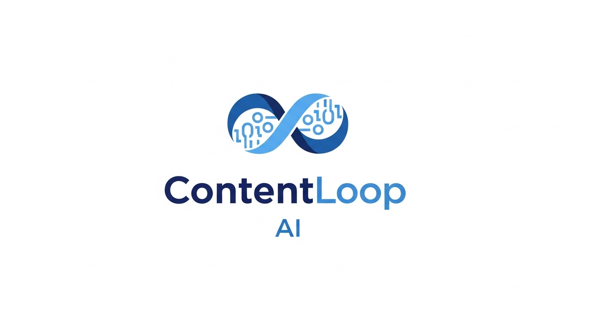
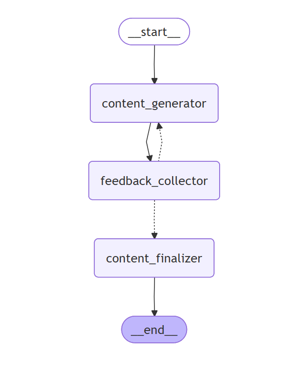

<div align="center">
  
  
  <h1>ContentLoop AI</h1>
  <p><em>Human-in-the-loop content creation</em></p>
</div>

An interactive content generation platform that uses human-in-the-loop AI to create, refine, and perfect professional content. 

> **ContentLoop AI transforms static AI generation into a dynamic, collaborative conversation where human feedback continuously shapes and refines content until it's perfect.**

ContentLoop AI combines the creativity of human insight with the power of AI to produce engaging, high-quality content through an iterative feedback process.

## 🔄 How It Works

<div align="center">
  
</div>

ContentLoop AI uses a collaborative approach where you provide your ideas and the AI expands them into polished content, then continuously refines based on your feedback until it's perfect.

## Project Structure

```
contentloop/
├── frontend/          # React + TypeScript + Vite + shadcn/ui
├── backend/           # FastAPI + Python with LangGraph
├── resources/         # Images and assets
└── README.md
```

## ✨ Features

- 🤖 **AI Content Expansion**: Start with your ideas, let AI create structured content
- 🔄 **Human-in-the-Loop**: Iterative refinement through real-time feedback
- 📝 **Flexible Input**: Provide topics, main points, experiences, or detailed outlines
- 🎨 **Custom Writing Styles**: Professional, friendly, casual, and personalized tones
- 📏 **Content Length Control**: Short, medium, and long-form content options
- 🎯 **Content Optimization**: Built-in hashtag suggestions and engagement analysis
- 🌙 **Modern Interface**: Clean, responsive design with dark/light themes
- 🚀 **Fast & Scalable**: FastAPI backend with LangGraph conversation management

## 🚀 Getting Started

### Prerequisites

- Node.js 18+ 
- Python 3.13+
- npm or yarn

### Backend Setup

1. Navigate to backend directory:
```bash
cd backend
```

2. Install dependencies with uv (recommended):
```bash
uv sync
```

Or with pip:
```bash
python -m venv .venv
source .venv/bin/activate  # On Windows: .venv\Scripts\activate
pip install -r requirements.txt
```

3. Set up environment variables:
```bash
cp .env.example .env
# Edit .env with your API keys
```

4. Start the server:
```bash
python start.py
```

The API will be available at:
- 🌐 Server: http://localhost:8000
- 📖 API Docs: http://localhost:8000/docs
- 🔧 ReDoc: http://localhost:8000/redoc

### Frontend Setup

1. Navigate to frontend directory:
```bash
cd frontend
```

2. Install dependencies:
```bash
npm install
```

3. Start the development server:
```bash
npm run dev
```

The frontend will be available at: http://localhost:5173

## 🔧 API Endpoints

### Human-in-the-Loop Content Generation

#### `POST /api/ai-agent/start`
Start a new content generation session

**Request Body:**
```json
{
  "topic": "Share your content ideas, main points, experiences, or insights...",
  "content_length": "medium",
  "writing_style": "professional"
}
```

#### `POST /api/ai-agent/feedback`
Provide feedback to refine the content

**Request Body:**
```json
{
  "session_id": "uuid",
  "feedback": "Make it more engaging and add examples"
}
```

### Content Optimization

#### `POST /api/optimization/analyze`
Get comprehensive content optimization suggestions

#### `POST /api/optimization/hashtags`
Get hashtag suggestions for your content

## 🛠️ Development

### Tech Stack

**Frontend:**
- React 18 with TypeScript
- Vite for blazing-fast development
- shadcn/ui components
- Tailwind CSS for styling
- Lucide React icons

**Backend:**
- FastAPI with automatic OpenAPI docs
- LangGraph for conversation flow management
- LangChain for AI model integration
- Pydantic for data validation
- UV for dependency management

### Architecture

ContentLoop AI uses a graph-based conversation system that:
1. **content_generator**: Expands user ideas into structured content
2. **feedback_collector**: Captures human feedback via interrupts  
3. **content_finalizer**: Completes the generation process

The system maintains session state and supports real-time feedback loops for iterative content improvement.

### Running in Development

1. Start backend: `cd backend && python start.py`
2. Start frontend: `cd frontend && npm run dev`
3. Open http://localhost:5173 in your browser

## 🏗️ Building for Production

### Frontend
```bash
cd frontend
npm run build
```

### Backend
```bash
cd backend
uvicorn main:app --host 0.0.0.0 --port 8000 --workers 4
```

## 🤝 Contributing

We welcome contributions! Please see our contributing guidelines:

1. Fork the repository
2. Create a feature branch (`git checkout -b feature/amazing-feature`)
3. Make your changes
4. Test both frontend and backend thoroughly
5. Commit your changes (`git commit -m 'Add amazing feature'`)
6. Push to the branch (`git push origin feature/amazing-feature`)
7. Open a Pull Request

## 📄 License

This project is open source and available under the MIT License.

---

<div align="center">
  <p>Made with ❤️ by the ContentLoop AI team</p>
  <p>
    <a href="https://github.com/yourusername/contentloop">⭐ Star us on GitHub</a> • 
    <a href="https://github.com/yourusername/contentloop/issues">🐛 Report Bug</a> • 
    <a href="https://github.com/yourusername/contentloop/issues">💡 Request Feature</a>
  </p>
</div>